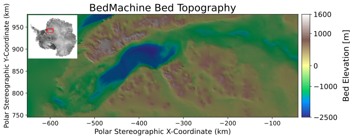
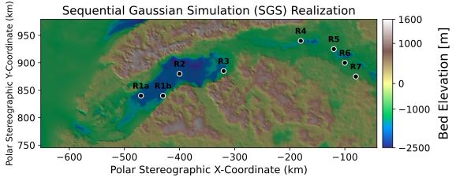
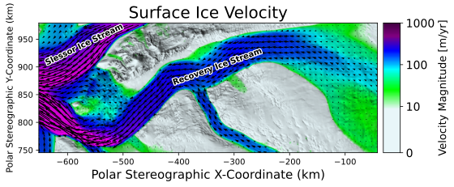
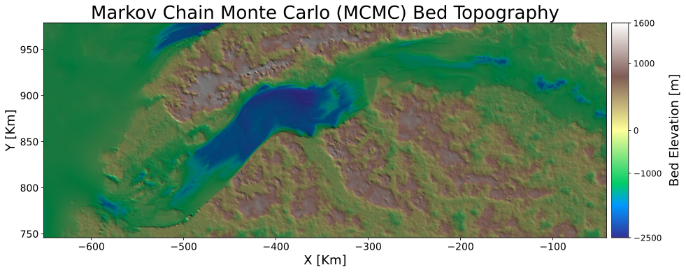
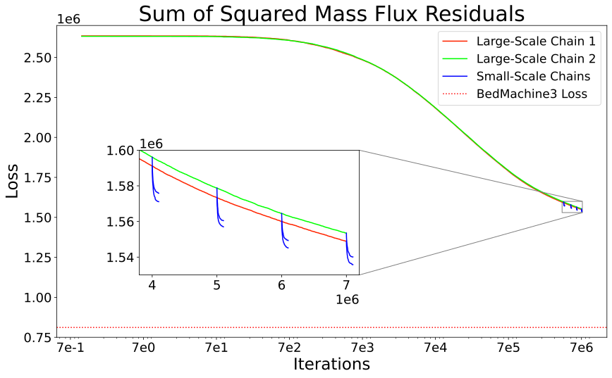
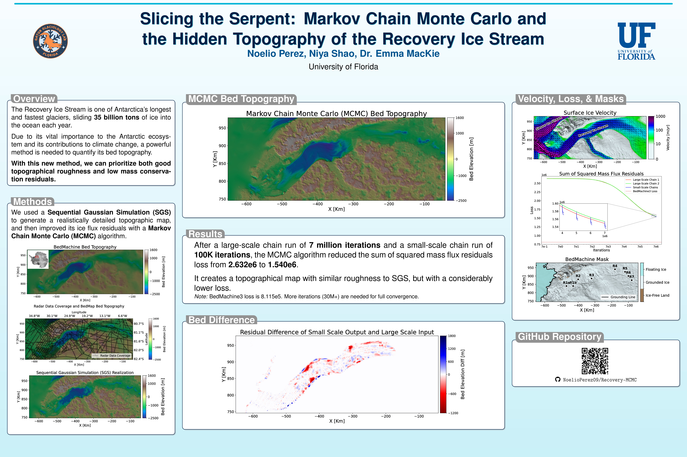

# Recovery-MCMC
## Overview
This project was made with the objective of creating a map <span>&#128506;&#65039;</span> of the Bed Topography <span>&#129704;</span> of an Antarctic Glacier <span>&#x1f1e6;&#x1f1f6;</span> that is both as realistically rough and detailed as the Topographies produced by a Sequential Gaussian Simulation (SGS) [1] and that also obeys the physical principles of conservation of mass (via ice flux residuals) as much as BedMachine3 or ideally more. Here specifically, we're mapping the Topography of the Recovery Ice Stream <span>&#127754;</span> <span>&#129398;</span> [2] one of Antarctica’s longest and fastest glaciers <span>&#129482;</span> <span>&#9889;</span>, sliding roughly 35 billion tons of ice into the ocean each year. The method used is a Metropolis–Hastings Markov Chain Monte Carlo (MCMC) algorithm <span>&#129518;</span> [3] with two parts (large scale and small scale), taking the produced SGS realization as input in order to start with a realistically rough and detailed topography and decrease its ice flux residuals as much as possible <span>&#128201;</span> to match the conservation of mass similar to BedMachine3 [4].


## Initial Topographies
Please download the images if you want to see them in fullscreen. Do not use the "Open image in new tab" as GitHub doesn't handle .svg visualization in fullscreen well.



Topography of BedMachine3, the current benchmark for ice flux divergence loss and mass conservation residuals [4].



Topography generated from a Sequential Gaussian Simulation [1], high level of detail and high resolution textures compared to BedMachine3 [4], but does not abide by the law of mass conversation. Used as a starting point for the large scale MCMC simulation.


Radar data and Topography, both from BedMap3 [5].


Surface velocity magnitude of study area [6]. Note: Velocities values were cut to get rid of the slessor ice stream velocity (not part of my study area), see ```1. Data Loading.ipyn``` for
more details of this.

## MCMC Topography 

Small scale chain Bed Topography output. Both realistically rough and considerably lower loss than SGS.


Loss graph of two large scale chains and eight small scale chains. Large scale chains ran for 7 million iterations and small scale chains ran for 100K iterations. Dotted red line shows BedMachine3's loss [4].


# Installation

Note: The following instructions are intended for UNIX-based Operating Systems (i.e. MacOS and Linux). If you are on Windows (not UNIX-based), you must download [Git Bash](https://git-scm.com/install/windows) or a similar UNIX command line interpreter to run this commands. Also, I used Python 3.12.3, but any Python version between 3.10 and 3.14 (inclusive) should work fine.

1. Clone the repository using ```git clone https://github.com/NoelioPerez09/Recovery-MCMC.git```.
2. Navigate to the downloaded directory using ```cd Recovery-MCMC```.
3. Create a ```venv``` virtual environment using ```python -m venv venv``` and activate it using ```source venv/bin/activate```.
4. Install all required libraries using ```pip install -r requirements.txt```.
5. After this, you can either run ```jupyter lab``` to use Jupyter's IDE or use any IDE of your liking. I personally used [Visual Studio Code](https://code.visualstudio.com/), but any IDE
that can run Python and Jupyter Notebook files should work.

# Description of Files & Directories

* ```beds``` Contains the two large scale and eight small scale chains bed realizations. For the small scale chain (those with two digits) The first digit of filename means that is coming from either the first or second large scale chain output and the second digit is in what iterations it was ran from. 1 for 7e6, 2 for 6e6, 3 for 5e6, and 4 for 4e6.
and the second digit
* ```extras``` directory contains Antarctica outline image used in poster and the SGS Bed data.
* ```figures``` directory contains all figures used in the poster plus a png and pdf version of the poster.
* ```gstatsMCMC``` Important Python files in order to process raw data and contains backend of the MCMC algorithm.
* ```trial``` directory contains results of large and small scale chains, along with parameters used and data weights in the large scale chains. Note that ```trial_1``` and ```trial_2```
are the large scale chains and the ```trial_11```, ```trial_12```, ... , ```trial_24``` are the small scale chains 1-4 (second number) for the 1st or 2nd large scale chain (first number).
* ```1. Data Loading.ipyn``` Generates the ```Recovery.csv``` with all the data needed for SGS and the MCMC algorithm. Takes approximately 1-2 hours to run.
* ```2. SGS.ipynb``` Generates the ```sgs.txt``` file with the topography data of SGS. Takes approximately 1-2 hours to run.
* ```3. Large Scale Chain.ipynb``` Generates the large scale chain topography. Takes approximately 6-8 hours to run.
* ```4. Small Scale Chain.ipynb``` Generates the small scale chain topography. Takes approximately 2-4 hours to run.
* ```5. Visualization.ipynb``` Contains the code to generate all plots used in the poster.
* ```requirements.txt``` Contains a list of all python libraries (package dependencies) and their version used the workflow

# Tutorial & Reproducibility
Jupyter notebooks (```.ipynb``` files) are ordered 1-5 to show the order to run to replicate results. Simply follow the instructions of each notebook and change the directories appropriately
depending on your local environment. The previous execution times are according to my own specs are specific times could vary significally depending on your computer specs. My computer specs:
* CPU: AMD Ryzen 7 9800X3D, 8 Cores, 16 Threads, 5.2 GHz
* RAM: 64 GB DDR5 6000 MT/s CL30
* SSD: Samsung 990 EVO Plus
* OS: Ubuntu 24.04.3 LTS

## Poster


## Acknowledgments
Original MCMC method creator: [Niya Shao](https://github.com/NiyaShao/geostatisticalMCMC) and MCMC paper [3].
<p></p>

## Sources
1. MacKie, E., Field, M., Wang, L., Schoedl, N., & Hibbs, M. (2022). GStatSim. Sequential Gaussian Simulation. https://gatorglaciology.github.io/gstatsimbook/4_Sequential_Gaussian_Simulation.html
2. Dow, C. F., Werder, M. A., Babonis, G., Nowicki, S., Walker, R. T., Csatho, B., & Morlighem, M. (2018). Dynamics of active subglacial lakes in recovery ice stream. Journal of Geophysical Research Earth Surface, 123(4), 837–850. https://doi.org/10.1002/2017jf004409
3. Shao, N., MacKie, E., Field, M., & McCormack, F. (2025). A Markov chain Monte Carlo approach for geostatistically simulating mass-conserving subglacial topography. Journal of Glaciology. https://doi.org/10.31223/x5sb2r
4. Morlighem, M. 2022. MEaSUREs BedMachine Antarctica, Version 3. Boulder, Colorado USA. NASA National Snow and Ice Data Center Distributed Active Archive Center.
https://doi.org/10.5067/FPSU0V1MWUB6.
5. Pritchard et al., (2025). Bedmap3 updated ice bed, surface and thickness gridded datasets for Antarctica. Scientific Data, 12(1), 414. https://doi.org/10.1038/s41597-025-04672-y
6. Rignot, E., J. Mouginot, & B. Scheuchl. (2017). Measures insar-based Antarctica Ice Velocity Map, version 2: National snow and ice data center. MEaSUREs InSAR-Based Antarctica Ice Velocity Map, Version 2. https://doi.org/10.5067/D7GK8F5J8M8R
7. Morlighem, M., E. Rignot, T. Binder, D. D. Blankenship, R. Drews, G. Eagles, O., et al. 2020. Deep glacial troughs and stabilizing ridges unveiled beneath the margins of the Antarctic ice sheet, Nature Geoscience. 13. 132-137. https://doi.org/10.1038/s41561-019-0510-8
